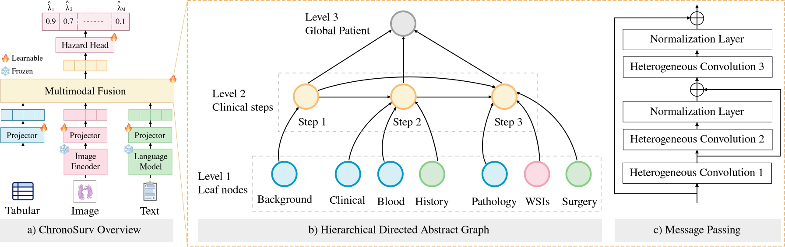

<p align="center">
  <h2 align="center">ChronoSurv: A Clinical Pathway-Guided Graph Framework for Multimodal Survival Analysis 🧪🔬🎯</h2>
  <h3 align="center"><b>MICCAI 2026</b></h3>
</p>

<p align="center">
  <a href="https://arxiv.org/abs/2606.19140"></a>
  <a href="https://www.python.org/downloads/"></a>
  <a href="https://conferences.miccai.org/2026/"></a>
</p>

---

### 🧩 Method Overview

We propose **ChronoSurv**, a Graph Neural Network architecture for multimodal survival prediction that models the clinical pathway as a directed heterogeneous graph with temporal progression. In the codebase, the model is exposed as `chrono_surv` with the matching datamodule type `UnifiedHNC_ChronoSurv`.

<p align="center">
  
</p>

---

### 🚀 Getting Started

#### Installation

**Requirements:** Python 3.12+

```bash
# Clone the repository
git clone https://github.com/MICS-Lab/ChronoSurv.git
cd ChronoSurv

# Install dependencies
pip install -r requirements.txt
```

#### 📂 Dataset Preparation

This project uses two head and neck cancer cohorts:

**1. HANCOCK** (primary dataset)

Download the [HANCOCK dataset](https://www.hancock.research.uni-erlangen.org/download) and place it in `./data/HANCOCK/`.

```
data/HANCOCK/
├── StructuredData/
│   ├── clinical_data.json
│   ├── blood_data.json
│   └── pathological_data.json
├── TextData/
│   ├── histories_english/
│   ├── surgery_descriptions_english/
│   └── reports_english/
├── TMA_CellDensityMeasurements/
│   └── TMA_celldensity_measurements.csv
├── WSI_LymphNode/
│   └── h5_files/
├── WSI_PrimaryTumor/
│   └── WSI_PrimaryTumor_*/
└── Split/
    └── folds_5.csv
```

**2. TCGA-HNSC** (secondary dataset)

Download [TCGA-HNSC](https://portal.gdc.cancer.gov/) clinical and WSI data and place it in `./data/TCGA-HNSC/`.

```
data/TCGA-HNSC/
├── clinical_data.json
├── WSI_PrimaryTumor/
│   └── h5_files/
└── Split/
    └── folds_5.csv
```

#### Build K-Folds (Optional)

```bash
# HANCOCK
python main.py folds --dataset hancock --data_root ./data/HANCOCK --n_folds 5 --random_seed 42

# TCGA-HNSC
python main.py folds --dataset tcga --data_root ./data/TCGA-HNSC --n_folds 5 --random_seed 42
```

---

### Training

#### Basic Usage

```bash
python main.py train --config config/chrono_surv.yaml

# For all available options:
python main.py train --help
```
---

### Evaluation

```bash
python main.py eval --checkpoint-dirs [checkpoint-dirs]
```

---

### 🙌 Acknowledgments

We acknowledge [Kist et al. 2024](https://www.nature.com/articles/s41597-024-03596-3) for making the HANCOCK dataset available.

### Useful Links

- [HANCOCK Challenge](https://www.hancock.research.uni-erlangen.org/download)
- [TCGA-HNSC](https://portal.gdc.cancer.gov/)
- [UNI](https://huggingface.co/MahmoodLab/UNI)
- [BioClinicalBERT](https://huggingface.co/emilyalsentzer/Bio_ClinicalBERT)

---

### 🔗 Citation

> [!IMPORTANT]  
> This project is based on the work by Miccinilli and Di Piazza 2026. If you use this code in your research, we would appreciate reference to the following paper:

```BibTeX
@inproceedings{md_chronosurv_2026,
  author    = {Hugo Miccinilli and Theo Di Piazza},
  title     = {ChronoSurv: A Clinical Pathway-Guided Graph Framework for Multimodal Survival Analysis},
  booktitle = {International Conference on Medical Image Computing and Computer-Assisted Intervention (MICCAI)},
  year      = {2026},
}
```
